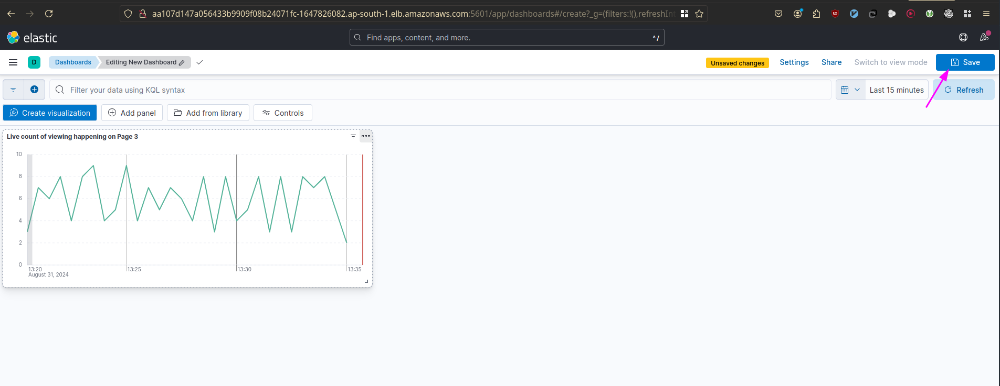
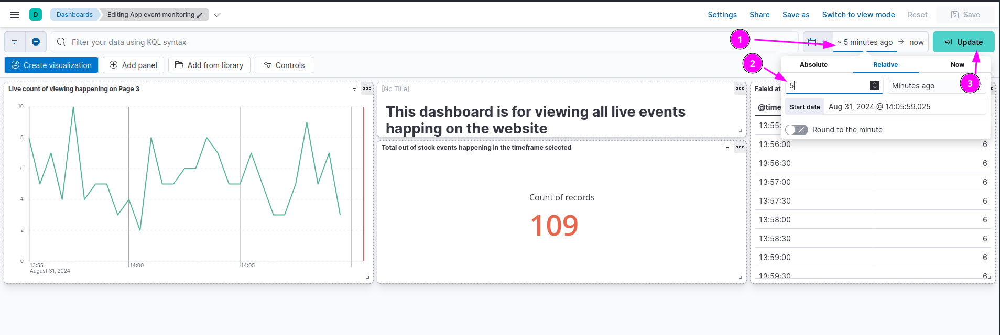

# Install EFK Stack
## Workflow
- [Create an amazon eks cluster and deploy ElasticSearch and Kibana](#create-an-amazon-eks-cluster)
- [Scaling Elasticsearch and Kibana](#scaling-elasticsearch-and-kibana)
- [Deploying E-Commerce App](#deploying-e-commerce-app)
- [Dashboarding with KQL in Kibana and Conditional Appearance on The Dashboard](#dashboarding-with-kql-in-kibana-)
- [Deploying Login App and Kibana on Kubernetes](#deploying-login-app-and-kibana-on-kubernetes-)

## Prerequisites
- kubectl
- aws account

## Setup
### Create an amazon eks cluster and deploy ElasticSearch and Kibana :
**1- Create an Amazon EKS cluster**
```bash
eksctl create cluster --name=eks-cluster \
    --region=ap-south-1 \
    --nodegroup-name=my-nodes \
    --node-type=t3.medium \
    --managed \
    --nodes=2 \
    --nodes-min=2 \
    --nodes-max=3
```
**2- Create efk Namespace**
```bash
kubectl create ns efk
```
**3- Deploy ElasticSearch**
```bash
cd elasticsearch-kibana
kubectl apply -f es-pvolume.yaml
kubectl apply -f es-service.yaml
kubectl apply -f es-statefulset.yaml
```
**4- Deploy Kibana** : The Elastic Search and Kibana version should be the matching version
```bash
kubectl apply -f kibana-service.yaml
kubectl apply -f kibana-deployment.yaml
```

---

---

---

### Scaling Elasticsearch and Kibana
```bash
kubectl get svc -n efk
cd scaling-ek-stack
```
- update `kibana.yml` with the URL
- update `config-map.yml` with the URL

```bash
kubectl get node
kubectl label nodes <node name> app=elasticsearch
kubectl apply -f .
```
### Deploying E-Commerce App
```bash
cd ../../event-generator
kubectl apply -f . 
kubectl logs app-event-simulator -n efk -f
kubectl get po -n efk
kubectl logs <fluent pod name> -n efk
```


---
### Dashboarding with KQL in Kibana :
---





---
**Conditional Appearance on Kibana Dashboards**
---




---
### Deploying Login App and Kibana on Kubernetes : 
---

### testing